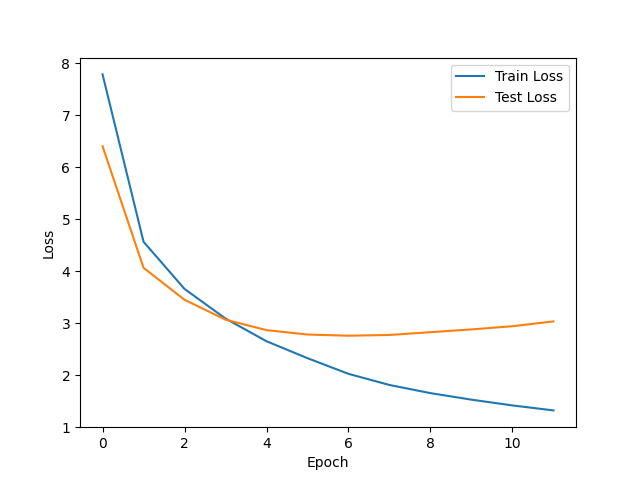

# Tagalog (Filipino)-English Machine Translation with Transformer-Based Attention
Robert “Reagan” Stephens, Alexander Christie, Carter Smith, Joe Niu

## Full Pipeline

run prepare.py
  - takes data from 'Cleaned Data.zip'
  - tokenize, encode, crop, and save datasets and tokenizers to file
  - you MUST run this before running train.py

run train.py
  - takes output of prepare.py, preps the data the rest of the way for training, trains model, and saves the following
    - model state_dict
    - aligned prediction and truth files (as pickle files, they are lists of lists)
    - train and test dataloader
    - losscurves plot
  - prints five random example translations
  - our training time: 9hrs 30 min

for evaluation, run BLEU.py and/or COMET.py based on your preffered evaluation metric
  - utilizes sources.pickle, truths.pickle, and preds.pickle to perform evaluation
  - you do not need to run full training to replicate evaluation based on our training output

run demo.py
  - loads model
  - if you don't want to train the model yourslef, download the pretrained state dict from here, the demo can load from the file: https://drive.google.com/file/d/1lyb5HHtMsnMCINKlYCfcKlYqx8dHLF8-/view?usp=sharing (fille too large for github)
  - creates a interactive CLI where you can type out a sequence, and get a tagalog translation
  - If you want to recreate the demonstration without worrying about cloning this repo, or taking any other steps, please see this notebook, and follow all instruction there: https://colab.research.google.com/drive/1i7XIc-qzqyp8yBXztJ3adoh4AZp0u3RX?usp=sharing


## Repository description
```
 ├── Datasets # bin for different data
    ├── Clean Data.zip #compressed archive for the data used in this study, after the english removal has been conducted on tagalog sentences (compressed for efficiency)
    ├── LICENSE # Usage license for OpenSubtitles corpus
    ├── README # corpus access information
    ├── data_acquisition.py # downloads the appropriate data from source
    └── en-tl.txt.zip # source data before english has been removed from the tagalog sentences (compressed for efficiency)
├── Testing_Experimentation # bin for any other files
    └── special_character_analysis.py
├── BLEU.py # script to run evaluation metrics (see above)
├── COMET.py # script to run evaluation metrics (see above)
├── README.md
├── TranslationModel.py # Contains the architecture for the translation model used 
├── demo.py # interactive translation for demonstration (see above)
├── englishremover.py # preprocessing example designed to eliminate majority english sentences that occur in the tl data. You do not need to run this for the pipeline, its outputs are already stored in Datasets/Clean Data.zip
├── en_tokenizer.pickle # saved version of english tokenizer
├── losscurves.png # visualization of train vs eval loss (NOTE: Predictions are basxed on model state at minimum eval loss (2.758135411204124))
├── pred.pickle # output prediction sentences for the entire test set
├── prepare.py # loads and preps data for training (see above)
├── sources.pickle # source english sentences for testing, aligned with truths and preds
├── test_translations.txt # 5 example input/ouput/ground truth examples, for qualitative description
├── tl_tokenizer.pickle # saved version of tagalog tokenizer
├── train.py # all logic to train and save appropriate output files (see above)
└── truths.pickle # aligned ground truths with preds.pickle for evaluation

```

## Notes
- pr1 (bpe) is stale, was an experiment in alternate encoding schemas

## Visualizations

